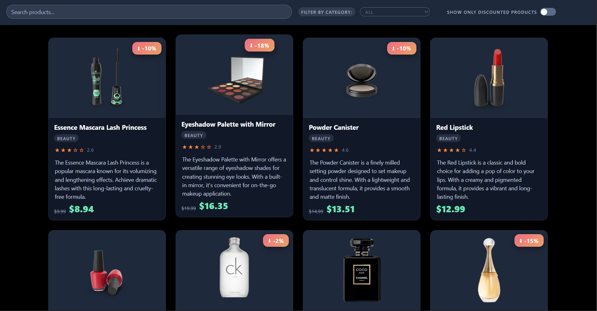
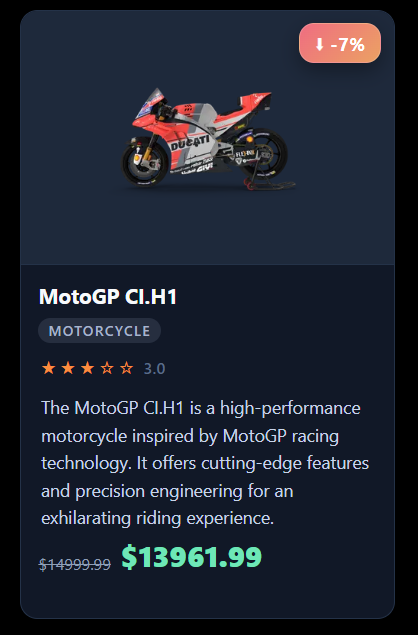

# Mi E-commerce

Este proyecto es una tienda de productos hecha con React + Vite, que consume la API pública [DummyJSON](https://dummyjson.com) para obtener productos y presenta un diseño con cards modernas.

## Descripción del proyecto

- Frontend en React (JSX)
- Datos de productos obtenidos desde `https://dummyjson.com/products`
- Características clave:
  - Precio descontado con precio original tachado
  - Badge de descuento integrado
  - Rating con estrellas (desde la API)
  - Imagen con hover y proporción consistente
  - Jerarquía visual y legibilidad optimizada

## Estructura de carpetas

- `src/`
  - `App.jsx`: componente principal y fetch a API
  - `components/`: componentes reutilizables
    - `ProductCard/`: tarjeta de producto + estilos
    - `SearchBar/`: buscador de productos
    - `CategoryFilter/`: filtro por categoría
    - `DiscountToggle/`: toggle para mostrar solo descuentos

## Instalación y ejecución local

1. Clonar el repositorio:

```bash
git clone https://github.com/JeffersonZT/mi-ecommerce.git
cd mi-ecommerce
```

2. Instalar dependencias:

```bash
npm install
```

3. Iniciar servidor de desarrollo:

```bash
npm run dev
```

4. Abrir en el navegador:

```
http://localhost:5173
```

## Capturas de pantalla

1. **Home con listado de productos**
   
2. **Product card con descuento y rating**
   
